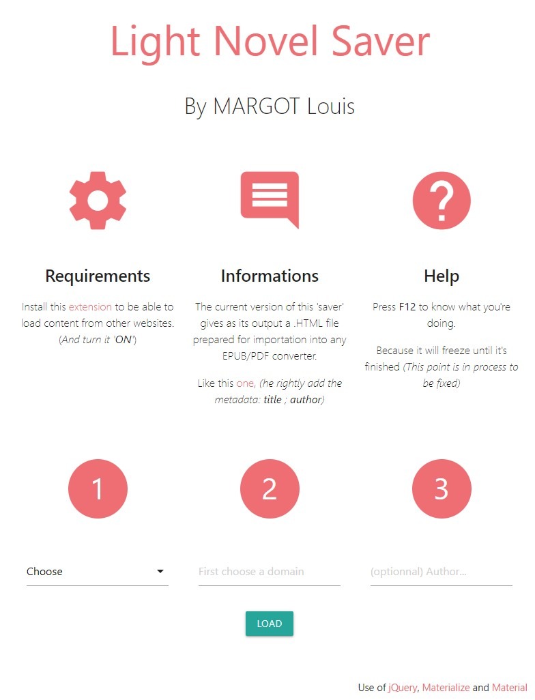

# Light-Novel-Saver

## Summary
Save in a HTML file all chapters of your preferred Light Novel directly from its website.

The output file can't be simplier in its architecture so it will be converted nicely in any format (EPUB, PDF, etc)) with metadata if you go on the advised converter on the page.

## Requirements
Install this [extension](https://chrome.google.com/webstore/detail/moesif-origin-cors-change/digfbfaphojjndkpccljibejjbppifbc/related?hl=en-US)
to be able to load content from other websites. (_And turn it '**ON**'_).

## How to use
HTML, JS and CSS languages are interpreted so you don't need to compile anything:
1. Make sure to download the whole project;
2. Just open **index.html**.

## Fonctionalities
Websites currently supported:
* www.lightnovelstranslations.com
* www.lightnovelworld.com
* www.novelpub.com

## Informations
If you see a supported website not working, please notify us with the **Issues** Pannel, add the **URL** so we can fix it.

Same, if you want us to implement a new website. Just say the word.

## Disclaimer
You are only allowed to use the content of this project when the light novel you want to download can't be bought in your country.

## More importantly
Enjoy your book ;)
