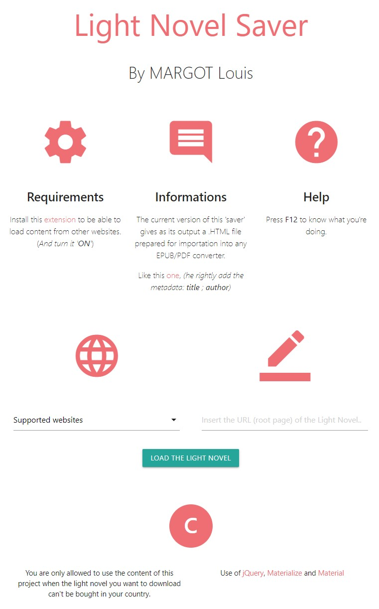
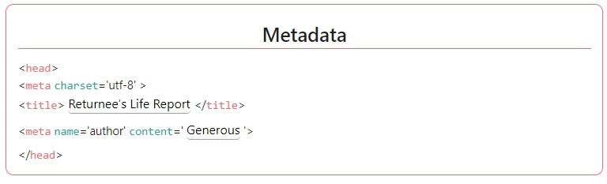

# Light-Novel-Saver

## Summary
Save in a HTML file all chapters of your preferred Light Novel directly from its website.

The output file can't be simplier in its architecture so it will be converted nicely in any format (EPUB, PDF, etc)) with metadata if you go on the advised converter on the page.

## Requirements
Install this [extension](https://chrome.google.com/webstore/detail/moesif-origin-cors-change/digfbfaphojjndkpccljibejjbppifbc/related?hl=en-US)
to be able to load content from other websites. (_And turn it '**ON**'_).

## How to use
### Offline
HTML, JS and CSS languages are interpreted so you don't need to compile anything:
1. Make sure to download the whole project;
2. Just open **index.html**.

### Online
On this link: https://loving-saha-24c469.netlify.app/.

## Example

## Functionalities
### Supported languages
* English
* Français

### Websites currently supported
* www.lightnovelstranslations.com
* www.lightnovelworld.com
* www.novelpub.com

### Metadata included

As you can see, the metadata are imported directly from the website and you can modify them while waiting for the chapters to be loaded.

## Informations
If you see a supported website not working, please notify us with the **Issues** Pannel, add the **URL** so we can fix it.

If you want us to implement a new website. Ask in the **Discussions** Pannel.

## Disclaimer
You are only allowed to use the content of this project to download a light novel when the law in your country and the coryrights of the light novel allows it.

## More importantly
Enjoy your book ;)
